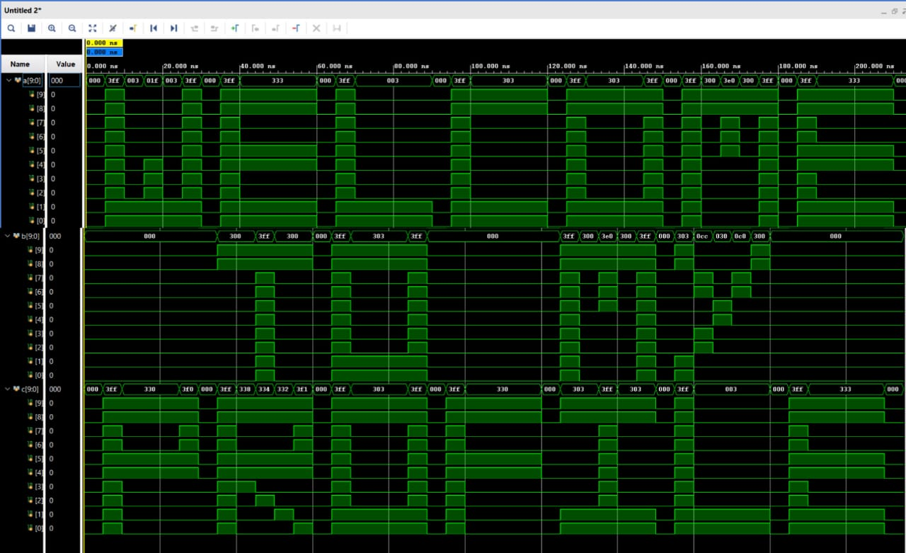

  
   
  <b>VLSI Waveform Art:</b> “WELCOME TO MY PROFILE†
  <i>Created using digital logic signals and waveform viewer – code truly speaks!</i>

<h1 align="center">Hi, I'm Jayavardhan Nakka 👋</h1>

  

Entry-Level Design Verification Engineer | Skilled in Verilog, SystemVerilog & UVM | Cadence Certified | RTL & Functional Verification | Open to VLSI Opportunities

---

### 🚀 **About Me**
- VLSI enthusiast & aspiring DV engineer
- Passionate about hardware verification, scalable testbenches
- Proficient in Verilog, SystemVerilog, UVM, Python, C, digital logic
- Hands-on with Cadence, Xilinx, and EDA flows  
- Open to collaborate on VLSI, RTL, DV

---

### 🌟 **Project Portfolio**
| Project | Description & Features | Tech Stack | Links |
|---------|-----------------------|------------|-------|
| **SRAM Design & Verification** | 8×8 SRAM RTL to synthesis, mailbox TB, timing/power/area | Verilog, SystemVerilog, Cadence, Xilinx | [GitHub](https://github.com/Jayavardhan-016/SRAM) |
| **TASNova Processor & Assembler** | Modular processor, assembler, customizable ISA, ALU, reg file | SystemVerilog | [GitHub](https://github.com/Jayavardhan-016/TASNova-A-Custom-32-bit-Processor-Assembler-) |
| **25 Days of Verilog** | Daily mini-projects: RTL, TB, waveform screenshots | Verilog | [GitHub](https://github.com/Jayavardhan-016/Verilog-Systemverilog) |
| **Mini VLSI Projects** | Adders, counters, FSMs in Verilog/SystemVerilog | Verilog, SystemVerilog | [GitHub](https://github.com/Jayavardhan-016/MINI-PROJECTS) |
| **Automatic Traffic System** | Real-time traffic control on 8051, Assembly & Proteus demo | Assembly, 8051 | [GitHub](https://github.com/Jayavardhan-016/4-Way-Traffic-Control-System-) |

---

### 🛠️ **Technical Skills**
- **Languages:** Verilog, SystemVerilog, UVM, C, Python
- **EDA Tools:** Cadence, Xilinx, ModelSim, Proteus, Keil
- **Verification:** Functional, assertion, mailbox, transaction-level
- **Digital Design:** RTL, simulation, debug
- **Other:** IoT, 8051/8086 MCUs

---

### 🎓 **Education**
- **B.Tech, ECE**  
  Aditya College of Engineering & Technology, JNTUK | 7.5 CGPA (2023–26)
- **Diploma, ECE**  
  Sai Ganapathi Polytechnic College | 73% | (2020–23)

---

### 🏅 **Certifications & Achievements**
- Cadence VLSI, Digital IC, Verilog, SystemVerilog
- NPTEL Microprocessor Interfacing
- 1st Prize: Embedded Bootcamp (RTech)
- Winner: ISHIP1 Innovation Challenge

---
### 📊 **GitHub Stats**

  
  
  

---

### 🤝 **Let’s Connect**
- 📧 Email: vardhanjaya988@gmail.com
- 📱 Phone: +91 9014240035
- 🌐 [Portfolio](https://github.com/Jayavardhan-016)
- 🔗 [LinkedIn](https://www.linkedin.com/in/nakkajayavardhan)
